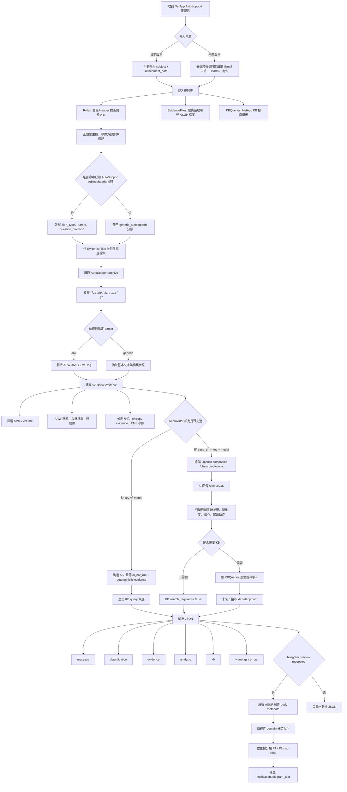
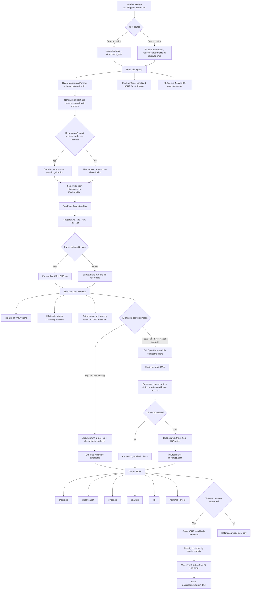

# NetApp ASUP AlertCheck Workflow

## 中文流程圖

```mermaid
flowchart TD
    A[收到 NetApp AutoSupport 警報信] --> B{輸入來源}
    B -->|目前版本| C[手動輸入 subject + attachment_path]
    B -->|未來版本| D[依信箱收信時間讀取 Gmail 主旨、Header、附件]

    C --> E[載入規則表]
    D --> E

    E --> E1[Rules: 主旨/Header 對應問題方向]
    E --> E2[EvidenceFiles: 優先讀取哪些 ASUP 檔案]
    E --> E3[KBQueries: NetApp KB 搜尋模板]

    E1 --> F[正規化主旨，移除外部郵件標記]
    F --> G{是否命中已知 AutoSupport subject/header 規則}

    G -->|是| H[取得 alert_type、parser、question_direction]
    G -->|否| I[使用 generic_autosupport 分類]

    H --> J[依 EvidenceFiles 從附件挑選檔案]
    I --> J

    J --> K[讀取 AutoSupport archive]
    K --> K1[支援 .7z / .zip / .tar / .tgz / .gz]
    K1 --> L{依規則指定 parser}

    L -->|arw| M[解析 ARW XML / EMS log]
    L -->|generic| N[抽取基本文字與檔案參照]

    M --> O[建立 compact evidence]
    N --> O

    O --> O1[影響 SVM / volume]
    O --> O2[ARW 狀態、攻擊機率、時間線]
    O --> O3[偵測方式、entropy evidence、EMS 參照]

    O --> P{AI provider 設定是否完整}
    P -->|有 base_url + key + model| Q[呼叫 OpenAI-compatible /chat/completions]
    P -->|缺 key 或 model| R[跳過 AI，回傳 ai_not_run + deterministic evidence]

    Q --> S[AI 回傳 strict JSON]
    S --> T[判斷目前系統狀況、嚴重度、信心、建議動作]

    T --> U{是否需要 KB}
    R --> V[產生 KB query 候選]
    U -->|需要| W[依 KBQueries 產生搜尋字串]
    U -->|不需要| X[KB search_required = false]

    W --> Y[未來：搜尋 kb.netapp.com]
    V --> Z[輸出 JSON]
    X --> Z
    Y --> Z

    Z --> Z1[message]
    Z --> Z2[classification]
    Z --> Z3[evidence]
    Z --> Z4[analysis]
    Z --> Z5[kb]
    Z --> Z6[warnings / errors]
    Z --> AA{Telegram preview requested}
    AA -->|是| AB[解析 ASUP 郵件 body metadata]
    AA -->|否| AC[只輸出分析 JSON]
    AB --> AD[依寄件 domain 分類客戶]
    AD --> AE[依主旨分類 P1 / P2 / no-send]
    AE --> AF[產生 notification.telegram_text]
```

## English Workflow

```mermaid
flowchart TD
    A[Receive NetApp AutoSupport alert email] --> B{Input source}
    B -->|Current version| C[Manual subject + attachment_path]
    B -->|Future version| D[Read Gmail subject, headers, attachments by received time]

    C --> E[Load rule registry]
    D --> E

    E --> E1[Rules: map subject/header to investigation direction]
    E --> E2[EvidenceFiles: prioritized ASUP files to inspect]
    E --> E3[KBQueries: NetApp KB query templates]

    E1 --> F[Normalize subject and remove external-mail markers]
    F --> G{Known AutoSupport subject/header rule matched}

    G -->|Yes| H[Get alert_type, parser, question_direction]
    G -->|No| I[Use generic_autosupport classification]

    H --> J[Select files from attachment by EvidenceFiles]
    I --> J

    J --> K[Read AutoSupport archive]
    K --> K1[Supports .7z / .zip / .tar / .tgz / .gz]
    K1 --> L{Parser selected by rule}

    L -->|arw| M[Parse ARW XML / EMS log]
    L -->|generic| N[Extract basic text and file references]

    M --> O[Build compact evidence]
    N --> O

    O --> O1[Impacted SVM / volume]
    O --> O2[ARW state, attack probability, timeline]
    O --> O3[Detection method, entropy evidence, EMS references]

    O --> P{AI provider config complete}
    P -->|base_url + key + model present| Q[Call OpenAI-compatible /chat/completions]
    P -->|key or model missing| R[Skip AI, return ai_not_run + deterministic evidence]

    Q --> S[AI returns strict JSON]
    S --> T[Determine current system state, severity, confidence, actions]

    T --> U{KB lookup needed}
    R --> V[Generate KB query candidates]
    U -->|Yes| W[Build search strings from KBQueries]
    U -->|No| X[KB search_required = false]

    W --> Y[Future: search kb.netapp.com]
    V --> Z[Output JSON]
    X --> Z
    Y --> Z

    Z --> Z1[message]
    Z --> Z2[classification]
    Z --> Z3[evidence]
    Z --> Z4[analysis]
    Z --> Z5[kb]
    Z --> Z6[warnings / errors]
    Z --> AA{Telegram preview requested}
    AA -->|Yes| AB[Parse ASUP email body metadata]
    AA -->|No| AC[Return analysis JSON only]
    AB --> AD[Classify customer by sender domain]
    AD --> AE[Classify subject as P1 / P2 / no-send]
    AE --> AF[Build notification.telegram_text]
```
